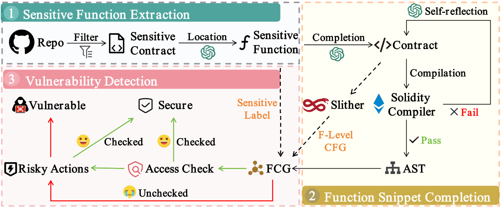

# SmartRepoGuard

**SmartRepoGuard** is a tool designed to detect and analyze security issues in repository-level smart contract projects 🔥. This repo is an artifact of our paper 📖 **SmartRepoGuard: Safeguarding Repository-level Smart Contract Projects from Access Control Vulnerabilities**. The source code of tool, instructions, and data of evaluation are included in this repo.



## Getting Started
To get started with **SmartRepoGuard**, follow the steps below to set up the necessary environment and begin using the tool.

### Prerequisites
Ensure you have the following installed:
- Python 3.8 or later
- pip (Python package manager)

### Installation
1. Clone the repository:
   ```bash
   git clone https://github.com/BugmakerCC/SmartRepoGuard.git
   ```
2. Navigate to the project directory:
   ```bash
   cd SmartRepoGuard
   ```
3. Install dependencies:
   ```bash
   pip install -r requirements.txt
   ```

### Usage
To analyze a **single smart contract**, follow these steps:
1. Place the smart contract file in the `target/sc/` directory.
2. Run the analysis script:
   ```bash
   python src/main.py -sc target/sc/contract.sol
   ```
3. Review the results in the `result/sc` directory.

To analyze a **repo-level smart contract project**, follow these steps:
1. Place the smart contract file in the `target/repo/` directory.
2. Run the analysis script:
   ```bash
   python src/main.py -repo target/repo/project_name
   ```
3. Review the results in the `result/repo` directory.


> ⚠️  **Note** 
When analyzing a repo-level smart contract project, API key for LLM is required (The key needs to be filled in `src/API_call.py`, and users can switch LLMs to use by adjusting the configuration in this file). To obtain the key, please refer to [https://www.gptapi.us/](https://www.gptapi.us/).


## Structure
This repo includes main components: experimental data (please see our [paper]()) and implementation of **SmartRepoGuard**. The contents of each folder are detailed as follows:

### Experimental Data
- `datasets/`
This folder contains datasets used for evaluating the tool. These datasets typically include:
    1. Vulnerable smart contracts (each one has been assigned CVE)
    2. On-chain smart contract (latest 5,000 deduplicated smart contracts on *Etherscan* before November 12th)
    3. Repo-level smart contract projects (sampled from [*DAppSCAN*](https://github.com/InPlusLab/DAppSCAN) dataset)

- `eval/`
Experimental results of evaluation (divided into three RQs).

### Tool Implementation
- `src/`
The core source code for **SmartRepoGuard**.

- `target/`
The folder for storing analysis targets is divided into two subfolders: `sc/` and `repo/`. The former folder is used for single smart contracts, while the latter is designated for repository-level smart contract projects.

- `sens_sig_res/`
Folder of intermediate results, used to store sensitive function signatures (corresponding with the files in the folder `target/`).

- `sens_code/`
Folder of intermediate results, used to store sensitive function code snippets.

- `sol_code/`
Folder of intermediate results, used to store completed smart contracts and function-level CFGs (corresponding with the files in the folder `sens_code/`).

- `result/`
This folder stores the results output by the tool after analyzing the target files (corresponding with the files in the folder `sol_code/`).

- `requirements.txt`
A file listing the Python dependencies necessary for running the tool.

> ⚠️  **Note** 
Please avoid making arbitrary changes to the file paths defined by the project, as this may result in execution failures.

## Contact
🙋 For any questions or feedback, please reach out to the repository maintainer or create an issue in this GitHub repository.

